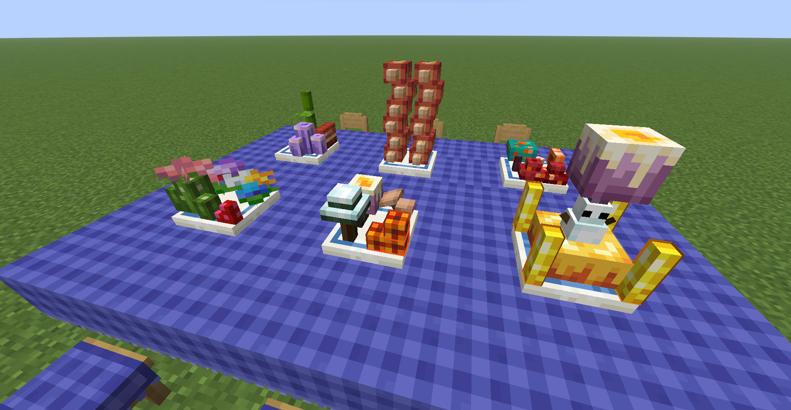
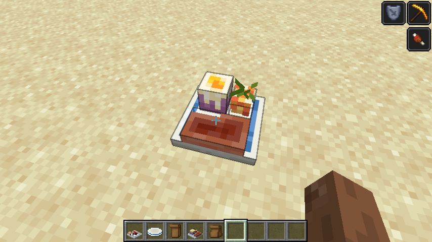
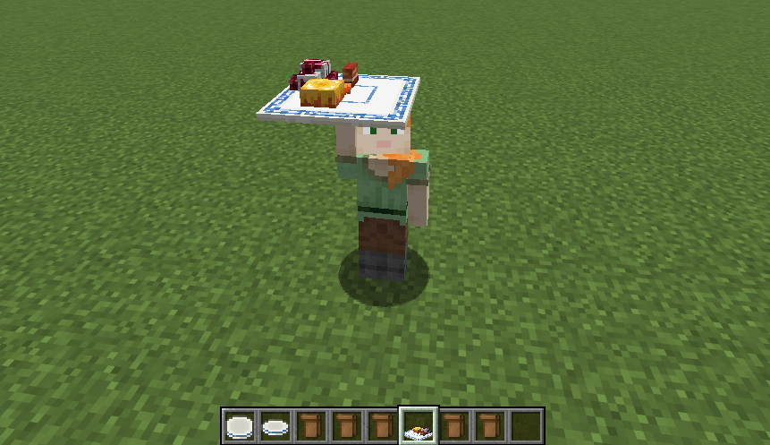

# Kaleidoscope: Hodgepodge 
# 森罗物语：杂烩

[English](#english-version) | [简体中文](#chinese-version)

## English

Kaleidoscope: Hodgepodge is an add-on for **Kaleidoscope: Cookery** that lets you take dishes apart and rearrange their ingredients into your own meals.

Collect ingredient models with Wrapping Bags, place them freely on plates and soup bowls, rotate each piece, and keep the finished arrangement when you pick it back up.

### Requirements

- Forge Config Api
- Kaleidoscope: Cookery
- Java 25 or newer

### Getting Ingredients

The Wrapping Bag has two modes. Hold **Shift** and right-click to switch between them.

**Storage Mode**

- Right-click a complete, untouched dish to pack all of its available ingredient models. The original dish is consumed.
- A dish that has already been eaten cannot be packed.
- A complete vanilla Cake can also be packed as one large ingredient model. A cake with any slices missing cannot be packed.
- Stackable foods provide one ingredient at a time.
- Right-click an individual ingredient on a custom plate or bowl to return only that ingredient to the bag.
- Each bag holds up to **9 ingredient models**.

The bag tooltip shows its current mode, contained ingredients, and their source dish or dishes. Filled and empty bags also use different item appearances.

In Creative Mode, the **Kaleidoscope: Packs** tab contains a pre-filled Wrapping Bag for every currently supported ingredient model.

### Creating a Custom Dish

Place any supported plate or a Porcelain Soup Bowl, then switch a filled Wrapping Bag to **Placement Mode**.

- **Right-click** a plate or bowl to place the next ingredient from the bag.
- **Left-click** the container while holding the bag to rotate the next ingredient clockwise by 90 degrees.
- A black outline previews the ingredient's size and position.
- A dark blue outline shows the available placement area.
- Existing ingredients have their own physical size, so aiming at a top or side places new ingredients around them instead of through them.
- Ingredients that do not suit the selected plate or soup bowl cannot be placed there.

An empty bag in Placement Mode will not change the container and will display a reminder.

### Plates and Bowls

| Container | Maximum ingredients | Placement space (width x height x depth) |
| --- | ---: | ---: |
| Wooden Plate | 20 | 16 x 16 x 16 pixels |
| Porcelain Plate | 40 | 16 x 32 x 16 pixels |
| Medium Porcelain Plate | 80 | 32 x 32 x 16 pixels |
| Large Porcelain Plate | 360 | 42 x 32 x 42 pixels |
| Porcelain Soup Bowl | 40 | 16 x 32 x 16 pixels |

Wooden plates offer a compact arrangement area. Porcelain containers provide twice the vertical space for taller and more elaborate compositions.

The Medium Porcelain Plate occupies two adjacent blocks. The Large Porcelain Plate occupies a 3 x 3 area and is placed around the block you target; placement fails if any part of that area is obstructed. Their ingredient spaces are continuous across block boundaries, so models can be positioned across the seams instead of being confined to one block at a time.

Both multi-block plates can be waterlogged. Breaking or clearing the structure restores water independently in every part that contained it.

### Soup Base

A newly crafted Porcelain Soup Bowl includes a soup base. Finishing a custom soup consumes both its ingredients and the soup base, leaving a bowl without soup.

Place that bowl in the world and right-click it with **Pork Bone Soup** from Kaleidoscope: Cookery to refill the soup base. The Pork Bone Soup is consumed and returns a regular Minecraft Bowl.

### Carrying Your Creations

Breaking a plate or bowl that contains ingredients preserves the complete arrangement on the dropped item. Placing it again restores every ingredient, position, and rotation.

Empty containers drop normally in Survival Mode. In Creative Mode, only containers holding a custom arrangement are preserved as drops.

### Lunch Box

Right-click a Lunch Box to open its 3 x 3 inventory. It can hold up to **9 Wrapping Bags**, including empty bags, so ingredient collections can be carried together without filling the main inventory.

### Eating Custom Dishes

- Hold a customized plate or bowl and use it in the air to eat the whole dish. Nutrition, saturation, and status effects from every ingredient are combined, and the empty container is returned afterward.
- Right-click a placed custom dish with an empty hand to eat one random ingredient. The container is returned when the final ingredient is eaten.
- Decorative ingredients marked as non-nutritional provide no hunger, saturation, or status effects.
- Some large ingredient models represent several portions. Their hunger value is multiplied by the number of portions represented by the model.

## 简体中文

森罗物语：杂烩是 **森罗物语：厨房** 的附属模组。它可以将菜品拆分成材料模型，再由玩家自由组合成属于自己的菜品。

使用打包纸袋收集材料，在盘子和汤碗中自由摆放、旋转每个模型；完成后的整套摆盘也可以被收起并带走。

### 前置需求

- Minecraft Java Edition
- Fabric Loader 0.19.3 或更高版本 / Neoforge
- 森罗物语：厨房
- Java 21 或更高版本

### 获取材料

打包纸袋拥有两种模式。按住 **Shift** 并点击右键即可切换。

**收纳模式**

- 对完整且从未食用过的菜品右键，会将它包含的材料模型全部装入纸袋，同时消耗原菜品。
- 已经被吃过的菜品不能打包。
- 完整的原版蛋糕也可以作为一个大型材料模型打包；缺少任何一片的蛋糕都不能打包。
- 对可堆叠食物右键，每次可以收取一个材料。
- 对准自定义盘碗中的单个材料右键，只会将指向的材料收回纸袋。
- 每个纸袋最多容纳 **9 个材料模型**。

纸袋的提示框会显示当前模式、内含材料，以及材料对应的一个或多个来源菜品。空纸袋与装有材料的纸袋也会使用不同的物品外观。

在创造模式中，可以通过 **森罗物语：打包食材** 物品栏直接获取每一种当前支持的材料纸袋。

### 制作自定义菜品

放置任意受支持的盘子或瓷汤碗，然后将装有材料的纸袋切换至 **放置模式**。

- 对盘碗点击 **右键**，放下纸袋中的下一个材料。
- 手持纸袋对容器点击 **左键**，让下一个材料顺时针旋转 90 度。
- 黑色线框会预览材料的尺寸与放置位置。
- 深蓝色线框会显示容器的可放置空间。
- 已放置材料拥有实际体积，对准它的顶面或侧面时，新材料会围绕它摆放，不会穿过已有模型。
- 不适合当前盘子或汤碗的材料无法放入。

放置模式下使用空纸袋不会改变容器，并会显示提示信息。

### 盘子与汤碗

| 容器 | 材料数量上限 | 摆放空间（宽 x 高 x 深） |
| --- | ---: | ---: |
| 木盘 | 20 | 16 x 16 x 16 像素 |
| 瓷盘 | 40 | 16 x 32 x 16 像素 |
| 中型瓷盘 | 80 | 32 x 32 x 16 像素 |
| 大型瓷盘 | 360 | 42 x 32 x 42 像素 |
| 瓷汤碗 | 40 | 16 x 32 x 16 像素 |

木盘适合紧凑的小型摆盘。瓷制容器拥有两倍的垂直空间，可以容纳更高、更复杂的组合。

中型瓷盘横跨相邻的两格方块。大型瓷盘占据 3 x 3 区域，并以玩家指向的方块为中心尝试放置；区域内存在阻挡时会放置失败。两种多方块瓷盘的材料空间均跨方块连续，模型可以横跨接缝摆放，不会被限制在单独的 16 x 16 平面中。

两种多方块瓷盘都支持含水。结构被破坏或清除时，每个原本含水的部分都会分别恢复水源。

### 汤底

新合成的瓷汤碗自带汤底。自定义汤品被完全吃完后，材料和汤底都会被消耗，返还的瓷汤碗不再含有汤底。

将无汤底的瓷汤碗放在世界中，再使用 **森罗物语：厨房的骨头汤** 右键，即可重新加入汤底。骨头汤会被消耗，并返还一个原版木碗。

### 携带你的作品

破坏装有材料的盘子或汤碗时，掉落物会完整保留当前摆盘。再次放置后，每个材料的位置和旋转角度都会恢复。

空容器在生存模式下正常掉落。创造模式下，只有包含自定义摆盘的容器会保留为掉落物。

### 午餐盒

右键午餐盒可以打开 3 x 3 收纳界面。午餐盒最多容纳 **9 个打包纸袋**，空纸袋也可以放入，方便集中携带材料而不占满主背包。

### 食用自定义菜品

- 手持自定义盘装菜品或汤品，对着空气长按右键即可一次吃完整份菜品。所有材料的饱食度、饱和度与状态效果会合并生效，食用后返还空容器。
- 空手右键放置在世界中的自定义菜品，会随机吃掉一个材料。吃完最后一个材料后返还空容器。
- 标记为无营养的装饰材料不会提供饱食度、饱和度或状态效果。
- 部分大型材料模型代表多份食物，食用时会根据模型代表的份数成倍提供饱食度。

